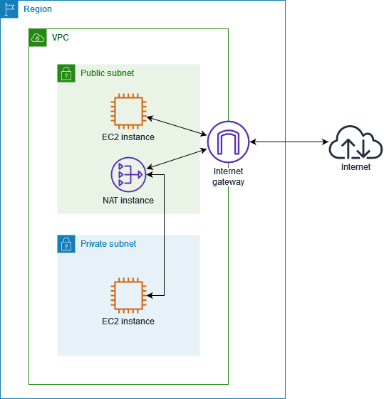

+++
title = '홈 네트워크 구성으로 알아보는 네트워크 기초'
date = 2023-12-27T22:00:39+09:00
math = true
toc = true
bold = true
draft = false
tags = ["network", "korean", "cloud", "system_engineering", "CIDR", "NAT"]
+++


네트워크 시리즈

-   홈 네트워크 구성으로 알아보는 네트워크 기초
-   VM network와 도커 네트워크 (예정)
-   VM으로 만드는 쿠버네티스 (예정)
-   p2p 통신을 위해 NAT을 뚫는 홀펀칭(hole punching) (예정)



## private network

보통 서버와 서버의 곧장 통신하는 경우도 있지만 ipv4가 부족한 현 상황에서는 ISP가 하나의 public ip(공인 ip)를 할당하며 해당 router는 내부 private ip를 public ip로 변환하는 일종의 문(gateway) 역할을 수행한다.

흔히 말하는 공유기는 가정용 라우터 + NAT 등의 기능을 수행한다.

이를 도식화하자면 다음과 같다.


이러한 구성은 홈 네트워크를 포함한 대부분의 네트워크에서 적용되는 구성이다.  
AWS 기준으로는 private subnet 대역에 존재하는 서버들은 직접적으로 외부 인터넷과 패킷을 주고 받을 수 없다. 이 부분은 NAT을 설명하면서 보충하도록 하겠다.

일반적인 private ip의 대역은 다음과 같다.

-   private ip 대역대
    -   Class A : **10**.0.0.0 ~ **10**.255.255.255 (10.0.0.0/8)
    -   Class B : **172.16**.0.0 ~ **172.31**.255.255 (172.16.0.0/12)
    -   Class C : **192.168**.0.0 ~ **192.168**.255.255 (192.168.0.0/16)

현재 홈 네트워크에서 구성된 private 대역대를 `ifconfig`(linux), `ip`(linux), `ipconfig`(window) 등으로 확인할 수 있다. 여기서는 좀 더 간편한 설명을 위해 `ipcalc`를 통해 private ip 대역대를 확인해보자.

```bash
ipcalc 172.30.1.56

# 출력 결과
Address:   172.30.1.56          10101100.00011110.00000001. 00111000
Netmask:   255.255.255.0 = 24   11111111.11111111.11111111. 00000000
Wildcard:  0.0.0.255            00000000.00000000.00000000. 11111111
=>
Network:   172.30.1.0/24        10101100.00011110.00000001. 00000000
HostMin:   172.30.1.1           10101100.00011110.00000001. 00000001
HostMax:   172.30.1.254         10101100.00011110.00000001. 11111110
Broadcast: 172.30.1.255         10101100.00011110.00000001. 11111111
Hosts/Net: 254                   Class B, Private Internet
```

위 결과, 현재 명령을 실행한 컴퓨터의 private ip는 172.30.1.56 이며, CIDR block의 크기가 24임을 확인할 수 있다.  
이로써, 해당 홈 네트워크 주어진 호스트 대역은 172.30.1.0 ~ 172.30.1.255 까지이다. 해당 범위 내에서 개개인의 기기와 라우터(게이트웨이)의 주소가 할당된다. 보통은 DHCP에 의해 자동으로 할당된다.

단, 가능한 호스트 영역 중 첫 주소(127.30.1.0)는 네트워크 식별 주소이며 마지막 주소(127.30.1.255)는 broadcast 주소로 선점되어 있다.

구체적으로 홈 네트워크를 도식화하자면 다음과 같이 표현될 수 있다. 만약 새로운 network interface가 추가된다면, 해당 interface에 대한 주소가 위에서 언급한 호스트 대역 내로 자동 할당될 것이라 추측할 수 있다.


PC A와 B 간에는 private ip를 통해 통신이 가능하다. 예를 들어 Window OS인 PC A에서 sshd를 실행하고, Mac OS로 구동 중인 PC B에서 ssh로 접속할 수 있다.

## public ip와 router

router의 주요 역할인 NAT과 port-forwarding에 대해 알아보겠습니다.

### NAT (Network Address Translation)

private ip는 외부에서 접근할 수 없습니다. 외부에서 접근하려면 public ip로 변환되어야 합니다. 이를 위해 router는 NAT(Network Address Translation)을 수행합니다.

NAT이란, 이름 그대로 네트워크 주소를 변환하는 기술이며 하나의 ip 주소를 다른 하나의 ip로 변환하는 것을 의미합니다. 이 과정은 NAT Table을 통해 이루어집니다. 보통은 여러 대의 기기가 public ip로 내부망에서 구별되며, 외부에서 바라보았을 때는 하나의 public ip로 보이게 됩니다.

<figure>

<figcaption>출처 : https://5kyc1ad.tistory.com/254</figcaption>
</figure>

아래 명령어를 통해 간단히 홈 네트워크의 공유기에 할당된 public ip를 확인할 수 있습니다.

```bash
curl http://checkip.amazonaws.com
curl http://icanhazip.com
curl http://ifconfig.me
```

이러한 NAT 기술은, 퍼블릭 클라우드를 구성할 때도 사용됩니다.

예를 들어, AWS의 VPC(Virtual Private Cloud)에서는 private subnet에 존재하는 사설 대역 ip의 서버들이 public subnet에 존재하는 NAT을 통해 public IP로 변환되어 외부와 통신하게 되어 egress[outbound]가 가능하지만, 외부 인터넷에서 ingress[inbound]는 안되는 상황을 구성할 수 있습니다.




Use NAT gateway instead of NAT instance

<blockquote>
AWS에서 제공하는 NAT 게이트웨이라는 관리형 NAT 디바이스를 사용하거나, EC2 인스턴스에서 NAT 디바이스(여기서는 NAT 인스턴스라고 함)를 생성할 수 있습니다. NAT 게이트웨이는 더 나은 가용성과 대역폭을 제공하고 관리에 소요되는 작업이 줄어들기 때문에 권장합니다.
- https://docs.aws.amazon.com/ko_kr/vpc/latest/userguide/vpc-nat.html
</blockquote>


### port-forwarding

특정한 포트로 들어오는 데이터 패킷을 다른 포트로 바꿔서 다시 전송해주는 작업입니다. 대부분의 라우터가 지원하는 기능입니다. 라우터의 설정을 조정할 수 있는 페이지에서 직접 설정할 수 있음을 확인할 수 있습니다.

<figure>

<figcaption>출처 : https://m.blog.naver.com/kangyh5/221531520692</figcaption>
</figure>

포트 포워딩을 통해 로컬 서버가 노출한 포트를 외부에 노출하지 않을 수 있는 장점이 있습니다. 서버를 배포할 때는 보통 포트를 숨기려고 하는데 필요한 서비스에서만 외부 접근을 허용하는 등의 보안적인 이유에서 입니다.

이러한 보안책을 뚫기 위해서 포트 스캐닝을 하는 경우도 있습니다. 제 github에 간단한 [포트 스캐닝 코드](https://github.com/DarrenKwonDev/netproc/blob/master/port_scanning/main.py)를 작성해 놓았습니다.

### NAT과 port-forwarding을 통해 클라우드의 subnet 간 통신 이해하기

<figure>

<figcaption>출처 : https://cloudneta.github.io/</figcaption>
</figure>

이제 우리는 위 도표를 홈 네트워크의 기술 이해에 기반해서 이해할 수 있습니다.

-   private subnet에서 출발(private ip) → 목적지(목적 웹 서버)
-   public subnet에 존재하는 NAT이 private IP를 또 다른 private IP로 변환합니다. 다수의 인스턴스에서 다른 private IP가 도착하더라도 하나의 private IP로 만듭니다. 추가로, 이 두 요청을 구분하기 위 PORT도 변환합니다. 변환된 후에는 public subnet의 RT를 참고하여 IGW로 이동합니다.
    -   NAT devices에서 PORT를 변환하므로 사실상 PAT이지만 관습적으로 이들을 구분해서 부르는 것 같지는 않습니다.
-   IGW에서 private IP(NAT에 의해 변환됨)를 public IP로 변환하고 이로써 인터넷과 소통할 수 있게 됩니다.
-   역으로 인터넷에서 들어오는 경우도 위의 순서를 역으로 밟아가며 진행됩니다. 목적지 IP는 NAT에서 private로 변환되고 NAT은 변환 정보에 따라 다른 IP로 변환된다.

## router 바깥의 인터넷

### traceroute로 패킷의 경로 확인하기

traceroute를 통해 router 바깥의 인터넷을 확인해보자.

```text
traceroute google.com # 명령어를 입력한 시점에 google.com은 DNS 서버를 거쳐 ip로 표현된다.

traceroute to google.com (142.250.207.110), 64 hops max, 52 byte packets

# router(gateway private ip)
1  172.30.1.254 (172.30.1.254)  2.760 ms  2.935 ms  2.510 ms

# router 바깥의 라우터
2  125.141.116.254 (125.141.116.254)  5.145 ms  7.277 ms *
3  112.190.42.17 (112.190.42.17)  7.403 ms  4.018 ms  4.137 ms
4  112.190.33.33 (112.190.33.33)  3.450 ms
112.190.32.225 (112.190.32.225)  3.886 ms
112.190.35.149 (112.190.35.149)  4.448 ms
5  112.174.47.201 (112.174.47.201)  12.834 ms
112.174.47.69 (112.174.47.69)  9.613 ms
112.174.47.73 (112.174.47.73)  14.453 ms
6  112.174.84.58 (112.174.84.58)  11.141 ms
112.174.84.42 (112.174.84.42)  13.433 ms
112.174.84.6 (112.174.84.6)  10.759 ms
7  142.250.165.78 (142.250.165.78)  30.529 ms
72.14.243.228 (72.14.243.228)  41.787 ms
72.14.202.136 (72.14.202.136)  34.776 ms
8  * * 108.170.243.65 (108.170.243.65)  36.102 ms
9  142.251.69.231 (142.251.69.231)  31.960 ms
142.251.70.23 (142.251.70.23)  31.472 ms
142.251.69.231 (142.251.69.231)  32.546 ms

# 도착
10  kix06s11-in-f14.1e100.net (142.250.207.110)  32.600 ms
    108.170.242.198 (108.170.242.198)  35.603 ms  35.615 ms
```

결과적으로 10홉을 거쳐서 목적지에 도달했다. 이는 router 바깥의 인터넷이 10개의 라우터를 거쳐서 도달한다는 것을 의미한다.

### 빛의 속도

네트워크의 속도를 손에 잡히는 정도로 이해하기 위해서는 빛의 속도를 고려해야 한다.  
빛은 진공 상태에서 1초에 30만km (29만 9792.458km) 정도를 간다.  
빛의 속도로 지구를 한 바퀴(42,000km)도는데 133ms가 걸린다. ping(왕복)으로 치면 133인 셈이다.

네트워크가 빛의 속도를 가졌다고 가정했을 때, 지구의 반대편에 다녀오는 <mark><u>RTT(rount trip time, 갔다가 돌아오는, **패킷 왕복 시간**)</u></mark>가 133인 셈이다. 그런데 FPS 게임에서 핑 200 넘어가면 느리다고 판단한다. 이 관점에선 빛이 그렇게 빠르지 않다.

게다가 실제로는 빛을 광섬유로 전달하는데 전송 매체의 굴절상 속도가 좀 떨어지며 라우터는 패킷을 어디로 보내야 하는 가를 결정하는데 시간이 걸린다. 이러한 이유로 실제로는 이보다 속도가 느리다.

### 내가 사용하는 인터넷의 latency와 bandwidth

-   bandwidth : 전송할 수 있는 데이터의 용량에 관한 것.
    -   `bits` per second, bps로 측정됨. (byte가 아니다)
    -   20Mbps면 초당 20,000,000비트 = 2,500,000바이트 = 2.5MB의 전송이 가능함을 의미한다.
-   latency는 빛의 속도에 제한되는 속도.

우리가 일상에서 흔히 말하는 '속도'는 latency가 아니라 bandwidth이다.  
모바일 요금에선 최저 보장 속도가 1Mbps, 3Mbps, 5Mbps니 같은 표현을 확인할 수 있다.

아래는 youtube 해상도 별 권장되는 bandwidth를 표현한 것이다.

<figure>

<figcaption>출처 : https://nhj12311.tistory.com/147</figcaption>
</figure>

### network 측정

network connection에서 뭘 측정해야 하는가?

<figure>

<figcaption>출처 : https://speed.cloudflare.com/</figcaption>
</figure>

cloudflare의 [AIM](https://developers.cloudflare.com/speed/aim/) (Aggregated Internet Measurement) 지표에 따르면, 다음 factor로 구성되어 있다고 한다.
(구체적인 공식은 공개하지 않고 있다.)

-   Download (internet → your app)
    -   how fast your network connection can get data from the test network.
    -   This is important when downloading large files such as updates for applications or streaming video services.
    -   처음부터 제 성능이 나지 않음. TCP의 경우, [slow start](https://en.wikipedia.org/wiki/TCP_congestion_control#Slow_start) 때문임.
-   Upload (your app → internet)
    -   how fast your network connection can transfer data to the test network.
    -   This is especially important for applications such as FTP or if you are the source for a live video stream. 특히 zoom 으로 비디오 송출할 때 upload 속도가 좋아야 상대방이 받던가 함.
-   Latency
    -   패킷을 쏘고 돌아오는 Round trip time latency (or RTT)를 말함.
    -   It is especially important for applications such as gaming and video chat, where you want to be as up to date as possible.
-   Jitter
    -   평균 RTT도 중요하지만, 이는 전체 그림의 절반에 불과합니다. RTT는 수시로 오르락내리락할 수 있으며, 이는 화상 채팅, 게임 또는 스트리밍과 같은 애플리케이션에서 두드러지게 나타납니다.
    -   latency가 얼마나 stable하냐, 그러니까 줌 화상이 1초 delay 됐다가, 갑자기 10초 delay 됐다가 latency가 널뛰기 하는 것과 관련 있다. This is directly related to how *stable* your latency is
    -   jitter가 낮으면 latency가 일정하다는 것이고, 높으면 널뛰기 한다는 것이다. latency의 분산이다.
    -   지터는 RTT 측정값에 얼마나 많은 변동이 있는지에 대한 인사이트를 제공합니다. 지터는 연속적인 RTT 측정 사이의 평균 거리(average distance between consecutive RTT measurements)로 계산됩니다. 지터가 낮을수록 좋습니다.
-   Packet Loss
    -   Packet loss indicates the presence of packets that are lost in the communication with the testing network.
    -   A high packet loss rate can cause jitter to rise and disrupt real-time sensitive applications like streaming and gaming.
    -   It's calculated as the percentage of UDP packets that are not received after being relayed through a WebRTC TURN server.
-   Loaded Latency

-   참고할만한 정보들[^1345]
    -   According to Cisco, jitter tolerance is as follows:
        -   지터: <30ms : Jitter should be below 30 ms.
        -   패킷 손실: <1% : Packet loss shouldn’t be more than 1%.
        -   latency : [Network latency](http://blog.datapath.io/what-is-network-latency) should not go over 150 ms. This is the latency in one direction meaning the round trip time (RTT) would be 300 ms.

[^1345]: https://medium.com/@datapath_io/what-is-acceptable-jitter-7e93c1e68f9b
