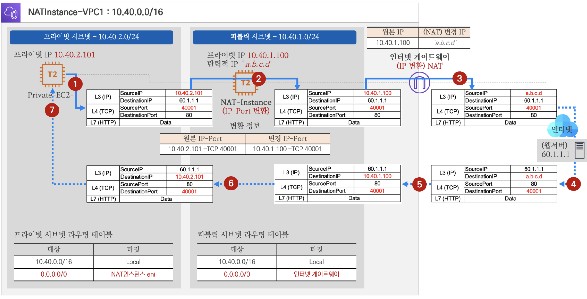

+++
title = '홈 네트워크의 기술로 살펴보는 클라우드 네트워크'
date = 2023-12-27T22:00:39+09:00
math = true
toc = true
bold = true
draft = false
tags = ["network", "korean", "cloud", "system_engineering"]
+++


네트워크 시리즈

-   홈 네트워크의 기술로 살펴보는 클라우드 네트워크
-   VM network와 도커 네트워크 (예정)
-   VM으로 만드는 쿠버네티스 (예정)
-   p2p 통신을 위해 NAT을 뚫는 홀펀칭(hole punching) (예정)



## private ip과 CIDR

보통 서버와 서버의 곧장 통신하는 경우도 있지만 ipv4가 부족한 현 상황에서는 gateway 역할을 하는 router가 있고, 해당 router는 public ip(공인 ip)를 가지곤 한다. 그 내부에 private ip(사설 ip)가 대부분의 상황이다.

이를 도식화하자면 다음과 같다.
참고로, 흔히 말하는 공유기는 가정용 라우터 + NAT 등의 기능을 수행한다.


이러한 구성은 홈 네트워크를 포함한 대부분의 네트워크에서 적용되는 구성이다.  
AWS 기준으로는 private subnet 대역에 존재하는 서버들은 직접적으로 외부 인터넷과 패킷을 주고 받을 수 없다. 이 부분은 NAT을 설명하면서 보충하도록 하겠다.

일반적인 private ip의 대역은 다음과 같다.

-   private ip 대역대
    -   Class A : **10**.0.0.0 ~ **10**.255.255.255 (10.0.0.0/8)
    -   Class B : **172.16**.0.0 ~ **172.31**.255.255 (172.16.0.0/12)
    -   Class C : **192.168**.0.0 ~ **192.168**.255.255 (192.168.0.0/16)

현재 홈 네트워크에서 구성된 private 대역대를 `ifconfig`, `ipconfig` 등으로 확인할 수 있다. 여기서는 좀 더 간편한 설명을 위해 `ipcalc`를 통해 private ip 대역대를 확인해보자.

```bash
ipcalc 172.30.1.56

# 출력 결과
Address:   172.30.1.56          10101100.00011110.00000001. 00111000
Netmask:   255.255.255.0 = 24   11111111.11111111.11111111. 00000000
Wildcard:  0.0.0.255            00000000.00000000.00000000. 11111111
=>
Network:   172.30.1.0/24        10101100.00011110.00000001. 00000000
HostMin:   172.30.1.1           10101100.00011110.00000001. 00000001
HostMax:   172.30.1.254         10101100.00011110.00000001. 11111110
Broadcast: 172.30.1.255         10101100.00011110.00000001. 11111111
Hosts/Net: 254                   Class B, Private Internet
```

위 결과, 현재 명령을 실행한 컴퓨터의 private ip는 172.30.1.56 이며, CIDR block의 크기가 24임을 확인할 수 있다.  
이로써, 해당 홈 네트워크 주어진 호스트 대역은 172.30.1.0 ~ 172.30.1.255 까지이다. 해당 범위 내에서 개개인의 기기와 라우터(게이트웨이)의 주소가 할당된다. 보통은 DHCP에 의해 자동으로 할당된다.

단, 가능한 호스트 영역 중 첫 주소(127.30.1.0)는 네트워크 식별 주소이며 마지막 주소(127.30.1.255)는 broadcast 주소로 선점되어 있다.

구체적으로 홈 네트워크를 도식화하자면 다음과 같이 표현될 수 있다. 만약 새로운 network interface가 추가된다면, 해당 interface에 대한 주소가 위에서 언급한 호스트 대역 내로 자동 할당될 것이라 추측할 수 있다.


위 주소는 private ip로,
내 컴퓨터의 public ip는 다음과 같이 확인할 수 있다.

## public ip와 router

router의 주요 역할인 NAT과 port-forwarding에 대해 알아보겠습니다.

### NAT (Network Address Translation)

private ip는 외부에서 접근할 수 없습니다. 외부에서 접근하려면 public ip로 변환되어야 합니다. 이를 위해 router는 NAT(Network Address Translation)을 수행합니다.

NAT이란, 이름 그대로 네트워크 주소를 변환하는 기술이며 하나의 ip 주소를 다른 하나의 ip로 변환하는 것을 의미합니다. 이 과정은 NAT Table을 통해 이루어집니다.

<figure>

<figcaption>출처 : https://5kyc1ad.tistory.com/254</figcaption>
</figure>

아래 명령어를 통해 간단히 홈 네트워크의 공유기에 할당된 public ip를 확인할 수 있습니다.

```bash
curl http://checkip.amazonaws.com
curl http://icanhazip.com
curl http://ifconfig.me
```

이러한 NAT 기술은, 퍼블릭 클라우드를 구성할 때도 사용됩니다.

예를 들어, AWS의 VPC(Virtual Private Cloud)에서는 private subnet에 존재하는 사설 대역 ip의 서버들이 public subnet에 존재하는 NAT을 통해 public IP로 변환되어 외부와 통신하게 되어 egress[outbound]가 가능하지만, 외부 인터넷에서 ingress[inbound]는 안되는 상황을 구성할 수 있습니다.



Use NAT gateway instead of NAT instance

<blockquote>
AWS에서 제공하는 NAT 게이트웨이라는 관리형 NAT 디바이스를 사용하거나, EC2 인스턴스에서 NAT 디바이스(여기서는 NAT 인스턴스라고 함)를 생성할 수 있습니다. NAT 게이트웨이는 더 나은 가용성과 대역폭을 제공하고 관리에 소요되는 작업이 줄어들기 때문에 권장합니다.
- https://docs.aws.amazon.com/ko_kr/vpc/latest/userguide/vpc-nat.html
</blockquote>


### port-forwarding

특정한 포트로 들어오는 데이터 패킷을 다른 포트로 바꿔서 다시 전송해주는 작업입니다. 대부분의 라우터가 지원하는 기능입니다. 라우터의 설정을 조정할 수 있는 페이지에서 직접 설정할 수 있음을 확인할 수 있습니다.

<figure>

<figcaption>출처 : https://m.blog.naver.com/kangyh5/221531520692</figcaption>
</figure>

포트 포워딩을 통해 로컬 서버가 노출한 포트를 외부에 노출하지 않을 수 있는 장점이 있습니다. 서버를 배포할 때는 보통 포트를 숨기려고 하는데 필요한 서비스에서만 외부 접근을 허용하는 등의 보안적인 이유에서 입니다.

이러한 보안책을 뚫기 위해서 포트 스캐닝을 하는 경우도 있습니다. 제 github에 간단한 [포트 스캐닝 코드](https://github.com/DarrenKwonDev/netproc/blob/master/port_scanning/main.py)를 작성해 놓았습니다.

### NAT과 port-forwarding을 통해 클라우드의 subnet 간 통신 이해하기

<figure>

<figcaption>출처 : https://cloudneta.github.io/</figcaption>
</figure>

이제 우리는 위 도표를 홈 네트워크의 기술 이해에 기반해서 이해할 수 있습니다.

-   private subnet에서 출발(private ip) → 목적지(목적 웹 서버)
-   public subnet에 존재하는 NAT이 private IP를 또 다른 private IP로 변환합니다. 다수의 인스턴스에서 다른 private IP가 도착하더라도 하나의 private IP로 만듭니다. 추가로, 이 두 요청을 구분하기 위 PORT도 변환합니다. 변환된 후에는 public subnet의 RT를 참고하여 IGW로 이동합니다.
    -   NAT devices에서 PORT를 변환하므로 사실상 PAT이지만 관습적으로 이들을 구분해서 부르는 것 같지는 않습니다.
-   IGW에서 private IP(NAT에 의해 변환됨)를 public IP로 변환하고 이로써 인터넷과 소통할 수 있게 됩니다.
-   역으로 인터넷에서 들어오는 경우도 위의 순서를 역으로 밟아가며 진행됩니다. 목적지 IP는 NAT에서 private로 변환되고 NAT은 변환 정보에 따라 다른 IP로 변환된다.
