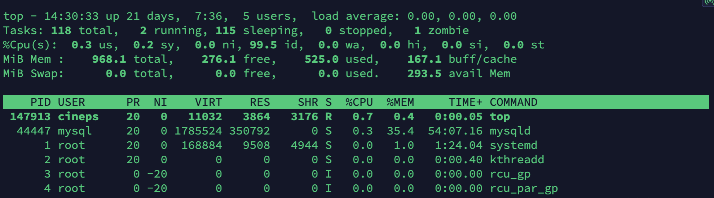
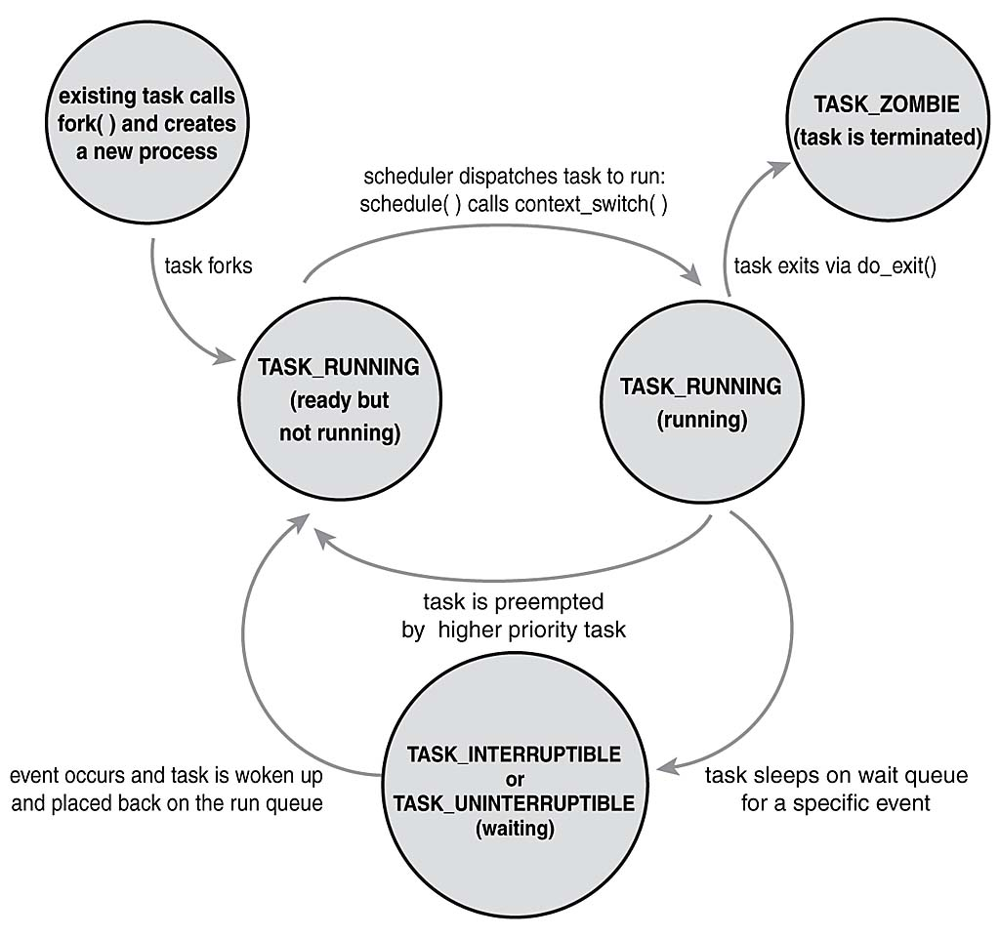

+++
title = 'top을 통해 확인할 수 있는 프로세스 정보들'
date = 2023-12-28T02:50:13+09:00
math = true
toc = true
bold = true
draft = false
tags = ["linux", "system_engineering", "korean", "kernel"]
+++

## top

```bash
top -hv|-bcEeHiOSs1 -d secs -n max -u|U user -p pids -o field -w [cols]
```



커맨드 사용 방법은 [리눅스 top 정리 및 설명](https://zzsza.github.io/development/2018/07/18/linux-top/)을 참고하는 것이 좋습니다.  
또한, 표현된 각 column 외에도 다른 metric은 man 페이지를 통해 확인하실 수 있습니다.

여기서는 top을 통해 살펴볼 수 있는 세부적인 여러 process 관련 정보 중 VIRT, RES, SHR, S, PR, NI들을 살펴보도록 하겠습니다.


task

리눅스에서 프로세스와 스레드는 개념적으로 구분되지만, 내부적으로는 모두 '태스크'로 관리됩니다.  
리눅스 커널은 프로세스와 스레드를 동일한 기본 구조인 'task_struct'를 사용하여 표현합니다.

[sched.h](https://elixir.bootlin.com/linux/latest/source/include/linux/sched.h)


**top의 개선판들**

-   [htop](https://github.com/hishamhm/htop), [vtop](https://github.com/MrRio/vtop), [gtop](https://github.com/aksakalli/gtop), [gotop](https://github.com/cjbassi/gotop)
-   저는 개인적으로 htop을 즐겨 쓰는 편입니다. `pstree` 명령어를 별도로 사용할 필요 없이 tree 형태로 프로세스를 확인할 수 있으며 스크롤과 마우스를 지원하기 때문입니다.

## cpu

### cpu 사용량

-   **us**, user : time running un-niced user processes
-   **sy**, system : time running kernel processes
-   ni, nice : time running niced user processes
-   id, idle : time spent in the kernel idle handler
-   **wa**, IO-wait : time waiting for I/O completion
-   hi : time spent servicing hardware interrupts
-   si : time spent servicing software interrupts
-   st : time stolen from this vm by the hypervisor

## memory

### virtual memory (메모리 가상화)

<blockquote>
A program selects a memory location using a virtual address. The processor translates this into a physical address and finally the memory controller selects the RAM chip corresponding to that address.
</blockquote>

즉, 프로세스는 virtual address를 통해 메모리를 다루지만, 실제 physical address로의 변환은 processor가 수행하는 셈입니다.[^2]

정리하자면,

-   **virtual address(가상 주소): 프로세스가 참조하는 주소**
-   **physical address(물리 주소): 실제 메모리 주소**

이며, 특정 가상 주소가 어느 물리 주소에 매핑되어있는지 변환하는 과정을 수행하는 과정은 cpu(processor) 내의 MMU(Memory Management Unit)가 수행합니다. MMU의 역할을 다시 정리하자면, CPU에에서 컴파일된 코드 실행시 가상 주소 메모리 접근이 필요할 때 해당 주소를 물리 주소 값으로 변환해주는 하드웨어 장치입니다.

가상 메모리 서브시스템의 실제 구현 세부 사항을 직접 확인해보고 싶다면 lwn의 관련 아티클[^1] 을 참고할 수 있습니다.

[^1]: https://lwn.net/Articles/253361/
[^2]: 이러한 가상(logical, virtual)과 물리(physical)의 분리는 메모리 뿐만 아니라 스토리지, 네트워크 등의 분야에서 자주 접하게 되는 패턴입니다. 물리를 감싸는 하나의 추상화된 레이어를 제공하여 파편화 해결, 공유화 등의 이점을 제공할 수 있습니다.

### Linux Memory Types

man 페이지에 따르면 프로세스가 소유한 메모리는 다음 4가지로 분류될 수 있습니다. 지금 당장 top의 출력물을 이해하는데 필요한 내용은 아니지만, 이후에 프로세스의 메모리 사용량을 살펴볼 때 필요한 내용이므로 간단히 정리해보도록 하겠습니다.

```text
                             Private | Shared
                         1           |          2
    Anonymous  . stack               |
               . malloc()            |
               . brk()/sbrk()        | . POSIX shm*
               . mmap(PRIVATE, ANON) | . mmap(SHARED, ANON)
              -----------------------+----------------------
               . mmap(PRIVATE, fd)   | . mmap(SHARED, fd)
  File-backed  . pgms/shared libs    |
                         3           |          4
```

위 사분면에 근거하여, top의 각 세부 정보들을 대략적으로 설명하면 다음과 같습니다.

우리가 흔히 메모리 영역을 heap, stack, data, code로 분류하곤 합니다. 이에 대해 관련 있는 내용은 다음과 같습니다.

-   stack : quadrant 1에 해당합니다. 컴파일 타임에 크기가 결정됩니다.
-   heap : quadrant 1에 해당하되 mmap을 통해 할당된 경우에도 속합니다. 우리가 흔히 쓰는 malloc이 qudrant 1에 속함을 확인해볼 수 있습니다.
-   CODE : the `pgms' portion of quadrant 3
-   DATA : the entire quadrant 1 portion of VIRT plus all explicit mmap file-backed pages of quadrant 3

top의 출력물에서 관련있는 정보는 다음과 같습니다.

-   VIRT : everything in-use and/or reserved (all quadrants)
-   SHR : subset of RES (excludes 1, includes all 2 & 4, some 3)
-   RES : anything occupying physical memory which, beginning with Linux-4.5, is the sum of the following three fields:
    -   RSan - quadrant 1 pages, which include any
    -   former quadrant 3 pages if modified
    -   RSfd - quadrant 3 and quadrant 4 pages
    -   RSsh - quadrant 2 pages

### memory commit 과정과 VIRT, RES, SHR

이제 종합적으로 프로세스가 처음 생성될 때 메모리를 할당 받는 과정인 memory commit을 살펴보겠습니다.

가상 메모리 할당 (<u>VIRT</u>): 프로세스가 생성될 때, 커널은 해당 프로세스에 대해 가상 메모리 공간(VIRT)을 할당합니다. 이 공간은 프로세스가 사용할 수 있는 메모리의 최대 범위를 나타내지만, 처음에는 실제 물리 메모리에 할당되지 않습니다. 이것은 메모리를 효율적으로 관리하고, 실제로 필요할 때만 물리 메모리를 사용하도록 하는 것입니다.

실제 메모리 할당과 페이지 폴트 (<u>RES</u>): 프로세스가 운영되는 동안, 특히 쓰기 작업이 시작될 때, 가상 메모리의 일부가 실제로 필요하게 됩니다. 이때 '페이지 폴트(page fault)'가 발생합니다. 페이지 폴트는 매핑된 물리적 메모리가 페이지 테이블에 존재하지 않을 때 발생하는 것으로, 이를 통해 커널은 해당 가상 메모리 공간에 대응하는 물리 메모리(RES)를 할당하게 됩니다.

공유 메모리 (<u>SHR</u>): 공유 라이브러리와 같이 여러 프로세스에서 공유되는 메모리 영역은 SHR(공유 메모리)로 표시됩니다. 이러한 메모리는 다른 프로세스와 공유되는 물리적 메모리 주소를 가리키며, 각 프로세스의 가상 메모리 공간을 통해 동일한 물리적 메모리 주소를 참조하게 됩니다. 이는 메모리 사용의 효율성을 높이고, 중복을 방지하는 역할을 합니다.

<details>
  <summary>VIRT, RES, SHR에 대한 man 페이지 설명</summary>
    
 
    1.  VIRT  --  Virtual Memory Size (KiB)
    The total amount of virtual memory used by the task.  It includes all code, data and shared libraries plus  pages  that  have
    been swapped out and pages that have been mapped but not used.
   
    22. RES  --  Resident Memory Size (KiB)
    A subset of the virtual address space (VIRT) representing the non-swapped physical memory a task is currently using.   It  is
    also the sum of the RSan, RSfd and RSsh fields.
    It  can  include  private anonymous pages, private pages mapped to files (including program images and shared libraries) plus
    shared anonymous pages.  All such memory is backed by the swap file represented separately under SWAP.
    Lastly, this field may also include shared file-backed pages which, when modified, act as a dedicated swap file and thus will
    never impact SWAP.

    30. SHR  --  Shared Memory Size (KiB)
    A subset of resident memory (RES) that may be used by other processes.  It will include shared  anonymous  pages  and  shared
    file-backed pages.  It also includes private pages mapped to files representing program images and shared libraries.

</details>

### memory overcommit

프로세스가 요구하는 메모리의 양은 결국 물리 메모리 공간의 한계를 넘을 수 없다.  
넘게 된다면 커널 파라미터인 vm.overcommit_memory의 정의에 따라 커널이 처리한다.[^1346]

```bash
sysctl vm.overcommit_memory # can be 0, 1, 2
```

[^1346]: https://mjmwired.net/kernel/Documentation/vm/overcommit-accounting

## process status

맨 페이지를 통해 좀 더 자세한 내용을 살펴보자.

```text
29. S  --  Process Status
    The status of the task which can be one of:
        D = uninterruptible sleep
        I = idle
        R = running
        S = sleeping
        T = stopped by job control signal
        t = stopped by debugger during trace
        Z = zombie
```

-   D (`un`interruptible sleep)
    i/o를 대기하고 있는 프로세스를 의미합니다. 프로세스가 D 상태라는 것은, run queue에서 나와 wait queue에서 대기하게 됨을 말합니다.
    만약 i/o 작업이 완료되면 (예를 들어, read/write가 완료되면) 프로세스는 다시 R 상태가 됩니다.
-   R
    cpu 코어는 한 번에 한 개의 프로세스만 실행할 수 있다.  
    다만 context switching을 통해서 빠르게 run queue에 담긴 프로세스들을 실행하여 동시에 실행되는 것처럼 보이게될 수 있다.  
    그리고 run queue에 담긴 프로세스들은 process status가 모두 R로 표기된다.
    결론적으론 실제로 cpu를 사용하고 있는 프로세스를 의미한다.
-   S (interruptible sleep)
    sleep 상태입니다. D와 다른 점은,
    i/o가 아닌 단순 sleep이나 콘솔의 입력을 기다리는 경우에는 S 상태가 됩니다.
-   T, t
    프로세스를 디버거, strace 등으로 중단시킨 상태를 의미합니다.
-   Z
    좀비 프로세스입니다. 종료되었지만, 부모 프로세스에 의해 아직 회수(리소스 해제)되지 않은 프로세스입니다. 부모 프로세스가 자식 프로세스의 exit code(exit(int) 혹은 main return(int))을 요청해야 합니다.

아래는 프로세스가 생성되고 변하는 상태의 변화를 나타낸 그림입니다.

<figure>

<figcaption>출처 : https://www.informit.com/articles/article.aspx?p=370047</figcaption>
</figure>

### 좀비 프로세스 제거를 위한 wait syscall

보통 좀비 프로세스를 제거하기 위해서 child process의 종료 시그널을 받아 처리하는 방식을 사용하곤 합니다. 아래는 간략한 예시입니다.

```c
void handle_child(int sig) {
    if (sig == SIGCHLD) {
        int status;

        // 성공시 종료된 ps의 pid반환.
        // 특정 pid가 아닌 -1을 전달함으로써 임의의 자식 프로세스 종료를 처리함.
        pid_t id = waitpid(-1, &status, WNOHANG); // non blocking
        if (WIFEXITED(status)) {
            printf("remove ps id : %d\n", id);
            printf("child send : %d\n", WEXITSTATUS(status));
        }
    }
}

int main(int argc, char* argv[]) {
    pid_t pid = 0;

    // signal handling
    struct sigaction act;
    act.sa_handler = handle_child;
    sigemptyset(&act.sa_mask);
    act.sa_flags = 0;
    sigaction(SIGCHLD, &act, 0);

    ... 생략

    return 0;
}
```

## PR, NI

run queue에 잡힌 task들은 PR(priority)와 NI(nice)에 따라 스케쥴러의 알고리즘에 의해 cpu를 할당받게 됩니다.

실제로 PR이 낮으면 먼저 dispatcher가 cpu에게 처리해줄 것을 요청한다.
NI는 PR의 조정값으로, 우선순위는 PR + NI로 결정된다.

예를 들어 process A의 PR: 10, NI: 0, process B의 PR: 10, NI: 5라면,
process A가 10, process B가 15의 우선순위를 갖게 된다.
따라서 process A가 먼저 cpu를 할당받게 된다.

nice는 **renice**로 조정될 수 있습니다.

```bash
# Niceness values range from -20 (most favorable to the process) to 19 (least favorable to the process).

# Change priority of a running process:
renice -n niceness_value -p pid

# Change priority of all processes owned by a user:
renice -n niceness_value -u user

# Change priority of all processes that belong to a process group:
renice -n niceness_value --pgrp process_group
```

다만, 수작업으로 우선순위를 조정하는 경우는 흔치 않으며, 조정으로 인한 차이가 극적이지 않아 대부분 기본값으로 사용한다.
