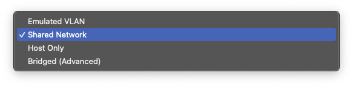

+++
title = 'VM network와 도커 네트워크'
date = 2023-12-28T00:05:13+09:00
math = true
toc = true
bold = true
draft = true
tags = ["network", "korean", "VM", "system_engineering", "docker"]
+++

## vm network option

<figure>

<figcaption>UTM 내 가상 머신의 네트워크 모드</figcaption>
</figure>

UTM의 문서[^1]에 따르면 네트워크 모드는 다음과 같다.  
[^1]: https://docs.getutm.app/settings-qemu/devices/network/network/

VMware에서도 비슷한 Bridge, NAT, Host-Only의 모드를 지원한다.  
그러나 이러한 용어들은 각 소프트웨어 제품이 임의로 정한 이름이며 formal terms이 아니다.

### Emulated VLAN

1.  각 VM 마다 VLAN이 생성된다.
2.  (kernel space가 아닌) user space 내에서 VLAN이 소프트웨어 적으로 생성된다.
3.  VM내 네트워크 트래픽은 UTM(vm 소프트웨어)의 프로세스에서 발생한 네트워크 트래픽으로 간주된다.
4.  각 VM은 독립된 사설 네트워크 환경을 가집니다. 예를 들어 내 홈 네트워크 내부 사설망이 172.30.5/24라면, 가상 랜은 192.168.0/24를 가질 수 있습니다.
5.  외부 인터넷과의 접속을 위해서는 호스트의 public ip를 사용합니다.

-   Shared Network  
    공유 네트워크 모드에서 가상 머신들은 호스트 머신의 네트워크 연결을 공유하며 NAT를 통해 인터넷에 접속합니다.
-   Host Only  
    호스트-온리 모드는 가상 머신이 호스트와의 네트워크 통신만 가능하게 하며, 외부 네트워크와는 연결되지 않습니다.
-   Bridge
    브리지 모드에서 가상 머신은 물리적 네트워크에 직접 연결된 것처럼 독립적인 IP 주소를 갖고 네트워크 리소스에 접근할 수 있습니다.

## docker network
