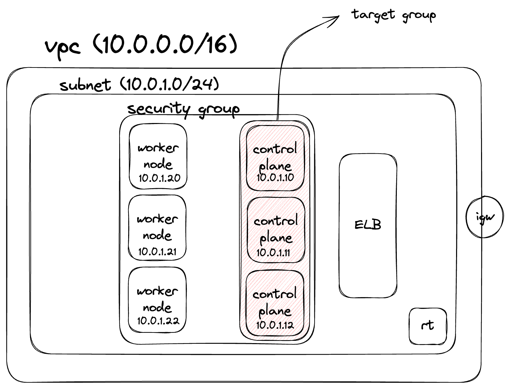

+++
title = 'Kubernetes the Hard Way: testimonial'
date = 2023-12-31T11:26:24+09:00
math = true
toc = true
bold = true
draft = false
tags = ["kubernetes", "k8s", "infra", "system_engineering", "korean", "scalability", "aws"]
+++


k8s the hard way?

본 포스트는 Kelsey Hightower의 [kubernetes-the-hard-way](https://github.com/kelseyhightower/kubernetes-the-hard-way) 와 그 fork 버전인 [kubernetes-the-hard-way-aws](https://github.com/prabhatsharma/kubernetes-the-hard-way-aws) 를 참고하면서 작성되었습니다.



## overall architecture

3개의 control plane으로 구성된 HA cluster를 구축합니다.

<figure >

</figure>

### 클러스터 구축 순서

1. VPC, subnet, route table, internet gateway, security group, key pair, 필요한 instance 생성
2. PKI 구축 및 각 컴포넌트들이 사용할 인증서와 키를 cfssl로 생성
3. 각 컴포넌트들의 kubeconfig 파일 작성
4. etcd 설치 및 control plane 연결
5. control plane을 위한 kube-apiserver, kube-controller-manager, kube-scheduler, kubectl 설치 및 systemd unit 파일 작성
6. worker node를 위한 설정(ex - swap off)과 kubelet, kube-proxy, kubelet, 컨테이너 런타임 설치 및 systemd unit 파일 작성
7. admin service account가 사용하기 위한 kubectl 수정 및 라우팅 테이블 수정
8. DNS based service discovery를 위한 DNS Cluster Add-on 설치

로 구성됩니다.

해당 구축 과정은 글의 초반에 언급한 원본을 참고하시면 됩니다.

## 결국 VM도 container도 OS도 모두 코드다. 구현해보면 더 잘 이해할 수 있다.

본래 문서에 따르면 k8s는 다음과 같은 컴포넌트들로 구성되어 있습니다.

<figure>

<figcaption>출처 : https://kubernetes.io/docs/concepts/architecture/</figcaption>
</figure>

첫 직장에서나 스터디에선 eksctl 등을 통해 `k8s를 black box처럼 사용하는 end-user` 입장이었기 때문에 이러한 컴포넌트들이 어떻게 동작하는지에 대해 생각해본 적이 없었습니다.

hard way 과정에는 control plane과 worker node내 서비스들을 직접 구축하는 과정이 포함되어 있습니다.
예를 들어 아래와 같이 직접 binary를 다운로드 받아 설치하는 과정이 포함되어 있습니다.

```bash
wget -q --show-progress --https-only --timestamping \
  "https://storage.googleapis.com/kubernetes-release/release/v1.21.0/bin/linux/amd64/kube-apiserver" \
  "https://storage.googleapis.com/kubernetes-release/release/v1.21.0/bin/linux/amd64/kube-controller-manager" \
  "https://storage.googleapis.com/kubernetes-release/release/v1.21.0/bin/linux/amd64/kube-scheduler" \
  "https://storage.googleapis.com/kubernetes-release/release/v1.21.0/bin/linux/amd64/kubectl"
```

또한 설치된 서비스들은 systemd unit 파일로 작성 된 후 systemd에 의해 daemonize 됩니다.  
예를 들어, kube-apiserver를 설치한 후 daemonize 하기 위해 다음과 같은 unit 파일을 작성합니다.

```text
[Unit]
Description=Kubernetes API Server
Documentation=https://github.com/kubernetes/kubernetes

[Service]
ExecStart=/usr/local/bin/kube-apiserver \\
  --advertise-address=${INTERNAL_IP} \\
  --allow-privileged=true \\
  --apiserver-count=3 \\
  --audit-log-maxage=30 \\
  --audit-log-maxbackup=3 \\
  --audit-log-maxsize=100 \\
  --audit-log-path=/var/log/audit.log \\
  --authorization-mode=Node,RBAC \\
  --bind-address=0.0.0.0 \\
  --client-ca-file=/var/lib/kubernetes/ca.pem \\
  --enable-admission-plugins=NamespaceLifecycle,NodeRestriction,LimitRanger,ServiceAccount,DefaultStorageClass,ResourceQuota \\
  --etcd-cafile=/var/lib/kubernetes/ca.pem \\
  --etcd-certfile=/var/lib/kubernetes/kubernetes.pem \\
  --etcd-keyfile=/var/lib/kubernetes/kubernetes-key.pem \\
  --etcd-servers=https://10.0.1.10:2379,https://10.0.1.11:2379,https://10.0.1.12:2379 \\
  --event-ttl=1h \\
  --encryption-provider-config=/var/lib/kubernetes/encryption-config.yaml \\
  --kubelet-certificate-authority=/var/lib/kubernetes/ca.pem \\
  --kubelet-client-certificate=/var/lib/kubernetes/kubernetes.pem \\
  --kubelet-client-key=/var/lib/kubernetes/kubernetes-key.pem \\
  --runtime-config='api/all=true' \\
  --service-account-key-file=/var/lib/kubernetes/service-account.pem \\
  --service-account-signing-key-file=/var/lib/kubernetes/service-account-key.pem \\
  --service-account-issuer=https://${KUBERNETES_PUBLIC_ADDRESS}:443 \\
  --service-cluster-ip-range=10.32.0.0/24 \\
  --service-node-port-range=30000-32767 \\
  --tls-cert-file=/var/lib/kubernetes/kubernetes.pem \\
  --tls-private-key-file=/var/lib/kubernetes/kubernetes-key.pem \\
  --v=2
Restart=on-failure
RestartSec=5

[Install]
WantedBy=multi-user.target
```

systemctl은 일종의 윈도우OS의 작업 관리자(task manager) 입니다.

```text
sudo systemctl daemon-reload
sudo systemctl enable kube-apiserver
sudo systemctl start kube-apiserver
```

솔직히 말하자면 systemd가 pid 1이며 모든 프로세스의 최상위 부모이며 리소스를 유닛 단위로 관리하는 등의 개념은 이해하고 있었습니다. 그러나 유닛 파일을 작성하고 systemd로 실행시킨 경험은 이번이 처음이었습니다.

이후 [firecracker](https://firecracker-microvm.github.io/)로 micro VM을 구성하여 엔드 유저에게 전달할 필요가 있는 교육 서비스를 구상 중인데, 이를 위해 systemd unit 파일을 작성하고 실행시키는 경험이 유용하게 쓰일 것 같습니다.
