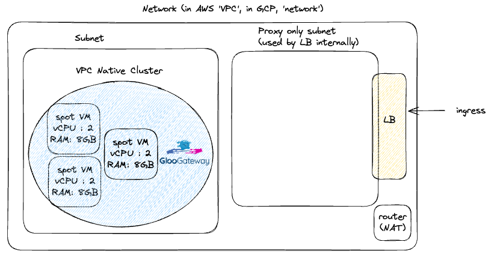
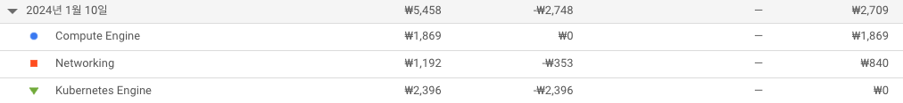

+++
title = 'GCP에서 저렴하게 교육용 쿠버네티스를 운용하는 방법'
date = 2024-01-06T18:50:30+09:00
math = true
toc = true
bold = true
draft = false
tags = ["kubernetes", "k8s", "infra", "system_engineering", "korean", "scalability", "gcp", "terraform"]
+++


**NOT FOR PRODUCTION**

교육용으로 쿠버네티스를 사용하거나, 간단한 토이 프로젝트를 registry로 밀어 넣고 서빙하는 용도로만 사용할 목적입니다.  
실제 프로덕션에서 사용하기에는 적합하지 않습니다.  


## trials

클라우드 비용은 아깝습니다. 그래서 저는 쿠버네티스를 로컬에서 구동하기 위해 아래와 같은 것들을 시도해보았습니다.

1. **라즈베리파이 클러스터 구축** -> cluster 수준으로 도입하려니 초기 비용이 많이 들기도하고 이리저리 집 안에서 선이 나뒹구며 집이 더러워지는 것을 견디기 힘들어서 기각.

2. **구형 android 기기에 termux 위에 k3s 설치** -> termux[^1]는 execve syscall[^2]을 통해서 표준 입출력을 커널에 밀어넣고 받아오는 linux emulator입니다. 따라서 쿠버네티스나 그 경량화 버전 등을 설치하기 위해서는 기기의 루트 권한이 필요합니다. 그러나 안드로이드는 기본적으로 루트 권한에 대한 접근을 막고 있어 rooting이 요구되므로 해당 방법은 현실적으로 원하는 목적을 달성하기에 기술적 비용이 너무 많이 투입됩니다. ROI가 나오지 않아 기각.

3. **개인 컴퓨터를 마스터 노드로 VM을 워커 노드로 구성** -> 로컬 환경에 마스터 노드에 필요한 리소스를 설치하는 것이 탐탁치 않았습니다. 현재 mac m1을 기본 작업용으로 사용하고 있기에 arm용으로 빌드된 바이너리를 하나씩 찾아서 구성하는 과정이 험난할 것으로 예상되었습니다. 로컬 환경에 종속된 특수한 환경을 구성하는 것 자체가 선호되는 일은 아니었습니다. 그렇다고 마스터 노드만을 위한 container를 별도로 띄우는 것도 간편함과는 거리가 있는 방법입니다. 이것도 ROI 문제로 기각.

4. **개인 컴퓨터에 VM 기반 마스터 노드 + 워커 노드 구성** -> 이 방법은 무난하게 동작했고, 관련 도서에서도 vagrant[^3] 스크립트를 통해 이미 구성해놓았기도 해서 편리한 편입니다. 그러나 제 노트북이 발열이 심해져서 사용을 포기했습니다. 쿠버네티스 worker node를 구성하기 위한 최소 리소스의 조건이 1 GB RAM, 2 CPU 이므로 노트북의 리소스를 쿠버네티스에 할당하면서 개발 작업을 수행하기에는 사용하기에는 무리가 있었습니다. 기각.

[^1]: https://termux.dev/en/
[^2]: https://www.man7.org/linux/man-pages/man2/execve.2.html
[^3]: https://www.vagrantup.com/

결국 클라우드 기반의 쿠버네티스를 구축하면서 최대한 비용을 절감하기로 결정했습니다.

digital ocean, vultr 등 control plane을 무료로 제공하면서 사용을 유도하는 (비교적 중소 규모의) 클라우드 업체가 존재하지만, 사용하지 않기로 하였습니다.  
DB 등은 cloud locked-in된 managed service를 이용하게 될텐데 의도치 않은 multi cloud 환경을 굳이 만들고 싶진 않았습니다.

따라서 1계정 당 1개의 control plane을 무료로 제공해주는 <u>gcp 기반</u>으로 구축하기로 결정하였습니다.

## 비용 최소화를 위한 구성

### 전체적인 클러스터 아키텍처

<figure>

<figcaption>출처 : my brain</figcaption>
</figure>

### 어디서 비용 절감이 이뤄지는가

1. 가장 저렴한 가격을 제공하는 region을 선택합니다.
    - region 마다 vm 가격이 다릅니다. GCP에서는 대부분의 인스턴스가 `us-cental1`이 저렴한 것으로 보입니다.[^4]
    - 위 스펙은 e2-standard-2 기준입니다.
2. spot vm을 사용합니다.
    - 가용성(availablity)이 떨어지는 것은 단점이지만, 비용을 절감할 수 있습니다.
    - spot vm shutdown에 대비하여 vm에 의존적인 값이 아닌 gloo를 통해 트래픽을 전달하도록 합니다.
    - 또한, 3대의 노드를 구성하도록 합니다. 3대를 굴려도 일반 vm 1대를 굴리는 것보다 저렴합니다.
3. stack driver 를 사용하지 않습니다.[^5]
    - 프로덕션에서는 권장되지 않습니다

[^4]: https://www.instance-pricing.com/provider=gcp/cheapest/
[^5]: https://registry.terraform.io/providers/hashicorp/google/latest/docs/resources/container_cluster#logging_service

## 구축 방법

직접 다 설명하기에는 양이 많으므로 그 자체가 문서인 terraform을 첨부합니다.

https://github.com/DarrenKwonDev/drkube

## billing check

실제 운용을 해보고 얼마나 비용이 나오는지 확인해보았습니다.


disclaimer

사용량이 늘어나면서 비용이 선형적으로 증가하는 서비스도 존재합니다만 본 문서는 개인이 사용 하는 교육용이므로 고려하지 않겠습니다.


-   e2-standard-2, 3대

e2-standard-2, 3대가 하루에 3000원 정도로 잡힙니다.

